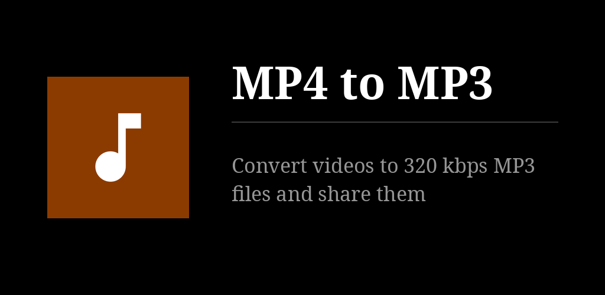
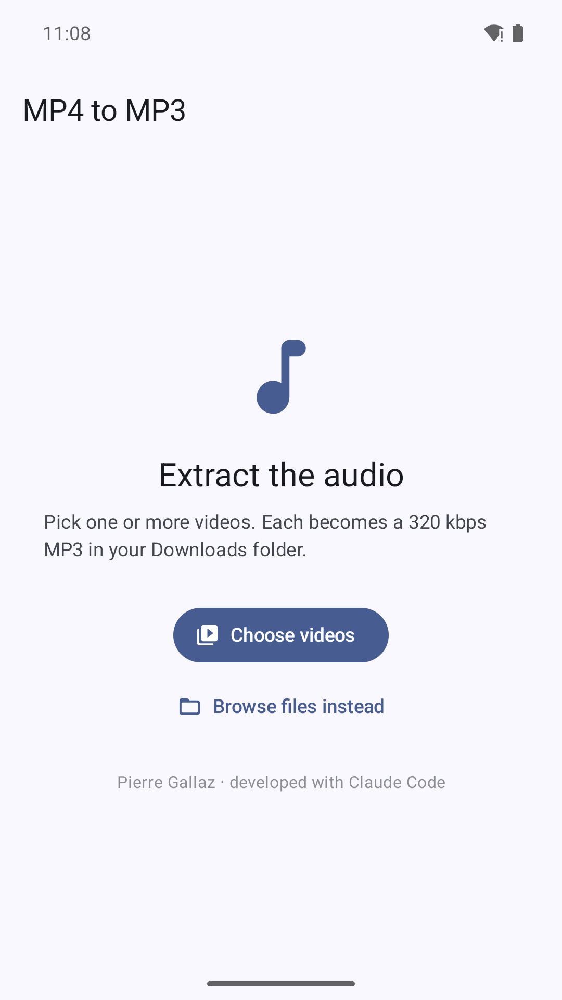

# MP4 to MP3

An Android app that does one thing: turn videos into MP3 files.

Pick one or more videos, and each one's audio track is extracted and re-encoded
to a **320 kbps CBR MP3** saved in your **Downloads** folder. When it's done you
get a list of the files, each with a **Share** button — so sending them to
kDrive, Telegram, WhatsApp or anywhere else is one tap away.

No accounts, no network access, no ads, no tracking. Everything happens on the
device.

## How it works

1. Videos are chosen with the **system photo picker** (or the file browser),
   which grants access to just those files — the app never asks for storage
   permission.
2. The audio track is demuxed and decoded with the platform decoder
   (`MediaExtractor` + `MediaCodec`), so every format the phone can play is
   supported: MP4/H.264 with AAC, MKV, WebM, 3GP, and so on.
3. PCM goes straight into **LAME** (compiled in, no temporary files) at
   320 kbps CBR. The source sample rate is kept when it is 32/44.1/48 kHz;
   anything else is resampled by LAME to a rate that can carry 320 kbps.
   Mono stays mono; more than two channels are folded down to mono rather than
   guessing at an unknown channel layout.
4. The result is written through `MediaStore` into `Downloads`, as a *pending*
   entry that is only published once the conversion succeeds — a failed or
   cancelled job never leaves a truncated MP3 behind.
5. The batch runs in a **foreground service** with a wake lock, so leaving the
   app or locking the screen does not interrupt it.

Videos shared to the app from another app's share sheet are converted too.

## Requirements

- Android 10 (API 29) or newer
- `arm64-v8a`, `armeabi-v7a` or `x86_64`

## Building

```sh
./gradlew assembleRelease
```

The NDK (27.1.12297006) and CMake 3.22.1 are required; both are installed by
Android Studio or `sdkmanager`. Nothing is downloaded at build time — the LAME
sources are vendored in this repository.

## Third-party code

`app/src/main/cpp/lame/` contains **LAME 3.100**, unmodified upstream sources
(`sha256 ddfe36cab873794038ae2c1210557ad34857a4b6bdc515785d1da9e175b1da1e`),
licensed **LGPL-2.1-or-later**. See `app/src/main/cpp/lame/COPYING`.

LAME's build system normally generates a `config.h`; since Android/NDK is a
fixed target, `app/src/main/cpp/config.h` is a hand-written equivalent. The LAME
sources themselves are untouched.

## Licence

GPL-3.0-only. See `LICENSE`.

## Crédits / Credits

© 2026 Pierre Gallaz. Développé avec [Claude Code](https://claude.com/claude-code) (Anthropic).
Licence GPL-3.0-only, voir `LICENSE`.

© 2026 Pierre Gallaz. Developed with [Claude Code](https://claude.com/claude-code) (Anthropic).
GPL-3.0-only licence, see `LICENSE`.

## Captures d'écran


